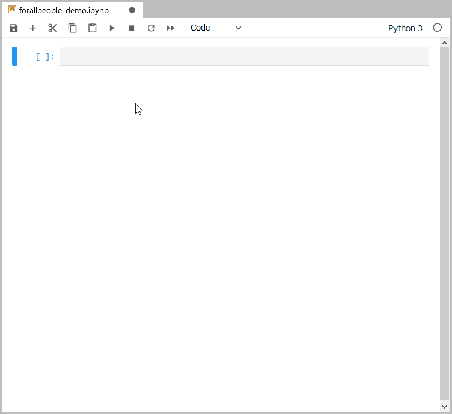
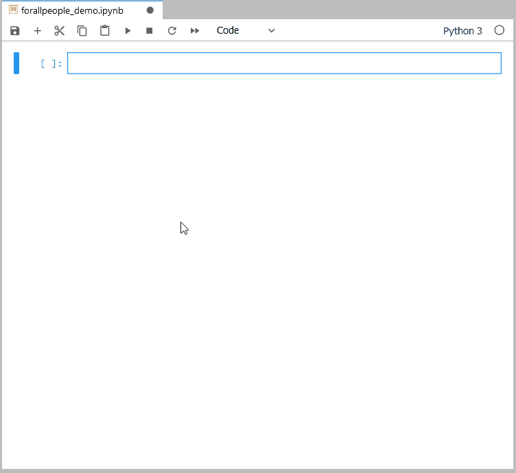

<h1 align = "center">forallpeople:<br>The world's units<br> at your fingertips</h1>

<p align="center">"For all people. For all time."<br>
<em>Nicolas de Caritat (Marquis de Condorcet), <br>in regards to the creation of the metric (SI) system.</em></p>

`forallpeople` is a Python library for providing access to units-aware calculations through the SI units system, and other units defined by the SI sytem (e.g. US customary units, Imperial).

While there are many other units libraries available for Python, `forallpeople` is unique in the following ways:

1. Physical quantities are automatically reduced during multiplication and division.
1. Physical quantities that are completely cancelled out return just a number (instead of a dimensionless unit).
1. Physical quantities carry their own dimension vectors and, as such, their definitions exist independently of the units environment they are in.
1. When loaded, the units variables can either be dynamically pushed to the module namespace or to the top-level namespace. This allows for faster code writing that looks like this `a = 5 * kg` instead of `a = 5 * si.kg`
1. Released on [PyPI](https://pypi.org/project/forallpeople/) on the day the new definition of the kilogram was adopted by the world on [World Metrology Day](https://www.worldmetrologyday.org/), 20 May 2019.

## Installing

You can install using pip:

```
pip install forallpeople
```

## Basic usage 1: Module-level namespace

The most basic use is just to import the library:

```python
import forallpeople as si
```

This will import the `Physical` class. It is the primary class in the module and is used to describe all physical quantities. 
`Physical` instances are **immutable**.

Upon import, the SI base units are instantiated and are available in the namespace as the following variables:

* `si.m` - meter
* `si.kg` - kilogram
* `si.s` - second
* `si.A` - ampere
* `si.cd` - candela
* `si.K` - kelvin
* `si.mol` - mole



### Loading an environment

```python
si.environment('default', [top_level=False])
```

This will load the 'default.json' file within the forallpeople module that describes the _SI derived units_, the units created by compounding the base units (e.g. Newton, Pascal, Celsius, Watt, Joule, etc.).

When you load an environment, whether it is the `default` environment or one you define, the *representation* of the units will change to fit the definitions in the environment. Environment definitions are *dimensional*, meaning, if you end up with a `Physical` of a dimension that matches a dimension in the environment, then the `repr()` of that instance will change to match the dimensioned unit in the environment.

It is important to note that, no matter what environment is loaded or not loaded, your `Physical` instances will always carry their value in the SI base units, e.g.:

```python
>>> pressure = force / area
>>> pressure = 208.333 Pa
>>> pressure.repr
>>> 'Physical(value=208.33333333333334, dimensions=Dimensions(kg=1, m=-1, s=-2, A=0, cd=0, K=0, mol=0), factor=1, _precision=3)'
```

Additionally, when you load an environment, the units defined in the environment will be instantiated as `Physical` and you can utilize them as variables in calculations.

The `'default'` environment defines and loads the following units as variables into the module namespace:

* `si.N` - newton
* `si.Pa` - pascal
* `si.J` - joule
* `si.W` - watt
* `si.C` - coulomb
* `si.V` - volt
* `si.F` - farad
* `si.Ohm` - ohm
* `si.S` - siemens
* `si.Wb` - weber
* `si.T` - tesla
* `si.H` - henry
* `si.lm` - lumen
* `si.lx` - lux
* `si.Bq` - becquerel
* `si.Gy` - gray
* `si.Sv` - sievert
* `si.kat` - katal

Because the units of `si.N` are one of the `Physical` instances that have now been instantiated and loaded into the `si` namespace, you can perform calculations with them directly: 

```python
>>> area = 3*si.m * 4*si.m
>>> force = 2500 * si.N
>>> force / area
>>> 208.333 Pa
```

## Basic usage 2: Top-level namespace

Everything from _Basic usage 1_ applies, except that, when loading an environment by setting `top_level=True`, all of the units described in the environment json file will instead be "pushed" into the top-level namespace, i.e. you would not type `5 * si.N` but `5 * N`.



## API

Each `Physical` instance offers the following methods and properties:

### Properties

* `.value`: A `float` that represents the numerical value of the physical quantity in SI base units
* `.dimensions`: A `Dimensions` object (a `NamedTuple`) that describes the dimension of the quantity as a vector
* `.factor`: A `float` that represents a factor that the value should be multiplied by to linearly scale the quantity into an alternate unit system (e.g. US customary units or UK imperial) that is defined in SI units.
* `.latex`: A `str` that represents the pretty printed `repr()` of the quanity in latex code.
* `.html`: A `str` that represents the pretty printed `repr()` of the quantity in HTML code.
* `.repr`: A `str` that represents the traditional machine readable `repr()` of the quantity: `Physical` instances default to a pretty printed `__repr__()` instead of a machine readable `__repr__()` because it makes them more compatible with other libraries (e.g. `numpy`, `pandas`, [handcalcs](https://github.com/connorferster/handcalcs), and `jupyter`).

### Methods

Almost all methods return a new `Physical` because all instances are **immutable**.

* `.round(self, n: int)`: Returns a `Physical` instance identical to `self` except with the display precision set to `n`. You can also call the python built-in `round()` on the instance to get the same behaviour.
* `.sqrt(self, n: float)`: Returns a `Physical` that represents the square root of `self`. `n` can be set to any other number to compute alternate roots.
* `.split(self)`: Returns a 2-tuple where the 0-th element is the `.value` of the quantity and the 1-th element is the `Physical` instance with a value set to `1` (i.e. just the dimensional part of the quantity). To reconstitute, multiply the two tuple elements together. This is useful to perform computations in `numpy` that only accept numerical input (e.g. `numpy.linalg.inv()`): the value can be computed separately from the dimension and then reconstituted afterwards.
* `.to(self, unit_name: str = "")`: Returns a new `Physical` instance with a `.factor` corresponding to a dimensionally compatible unit defined in the `environment`. If `.to()` is called without any arguments, then a list of available units for that quantity is printed to `stdout`.

## Dimensionally inconsistent calculations

It is not uncommon for some calculations to use formulas whose dimensions seem to magically appear on their own. The `forallpeople` library can handle these calculations if the "hidden dimensions" are recognized and accounted for by the user.

Example: in the Canadian concrete design code it is recognized that `sqrt(1*MPa)` results in units of MPa instead of MPa<sup>0.5</sup>. Here is one way this can be managed in `forallpeople`:

```python
>>> import forallpeople as si
>>> from math import sqrt
>>> si.environment('default')
>>> MPa = 1e6 * si.Pa
>>> f_c = 35 * MPa
>>> sqrt(f_c) * MPa
5.916 MPa
```

This behaviour occurs because of the way `__float__` is defined in the `Physical` class: if `float()` is called on a `Physical`, the returned value will be the numerical portion of the auto-reduced, auto-prefixed unit representation.

Example:

```python
>>> import forallpeople as si
>>> from math import sqrt
>>> si.environment('default')
>>> MPa = 1e6 * si.Pa
>>> f_c = 35 * MPa
>>> f_c # As expected
35.000 MPa
>>> float(f_c) # The numerical portion of the prefixed unit
35.0
>>> f_c.value # However, the actual value is 35e6 Pa
35000000.0
>>> sqrt(f_c) # Sqrt of "35"
5.916079783099616
>>> sqrt(f_c.value) # Sqrt of "35000000.0"
5916.079783099616
```

Many of Python's math functions will first attempt to call `float()` on an argument that is not already a float. `forallpeople` takes advantage of this by ensuring the float value returned is the same number you would see in the unit representation. If you prefer the operation be performed on the base unit value, then simply substitute the `.value` value as the function argument.

## How `Physical` instances work

`forallpeople` is for describing **physical quantities** and defines a single class, `Physical`, to represent them. `Physical` instances are composed of four components (as attributes): 

* `.value`: a `float` that is the numerical value of the quantity in the SI base units.
* `.dimensions`: a `NamedTuple`, called `Dimensions`, that describes the dimensionality of the physical quantity in terms of the SI base units.
* `.factor`: a `float` that can be used to define a physical quantity in an alternate unit system that is linearly based upon the SI units (e.g. US customary units, imperial, etc.).
* `.precision`: an `int` that describes the number of decimal places to display when the `Physical` instance is rendered through `.__repr__()`, default value is `3`.
* `.prefixed`: a `str` that represents a prefix abbreviation in the SI units system, e.g. `"k"` for "kilo", `"n"` for "nano". This allows the user to over-ride .

Because `Physical` instances are immutable (just like `int`, `float`, `str`, and `bool`), the user cannot set these attributes directly. It also means that any arithmetic operation on a `Physical` instance returns a new instance. Arithmetic operations is the intended way of creating new `Physical` instances.

### Dimension vectors

`Physical` instances track the dimensions of their physical quantities by using vectors. The vector is stored in the `Dimensions` class, which is a `NamedTuple`. Using the vector library, [tuplevector](https://github.com/connorferster/tuplevector) (which is "baked in" to `forallpeople`), vector arithmetic is performed on `Dimensions` objects directly. 

### Arithmetic on `Physical` instancess

Arithmetic on `Physical` instances work mostly how you would expect, with few caveats:

* Addition and subtraction: 
  * Two (or more) instances will add/sub if dimensions are equal.
  * One instance and one (or more) number(s) (`float`, `int`) will add/sub and assume the units of the instance.
  * e.g. `a = 5*si.m + 2*si.m`, `b = 5*si.kg + 10`.
* Multiplication:
  * Instances will multiply with each other and their dimensions will combine.
  * Instances will multiply with numbers and will assume the units of instance(s) that were also a part of the multiplication.
  * e.g. `c = 12 *si.m * 2*si.kg * si.s`, `d = 4.5*si.m * 2.3`.
* Division (true division):
  * Instances will divide by each other and the difference of their dimension vectors will be the dimensions of the new instance.
  * Instances can also divide with numbers and will assume the units of the instance(s) that were also a part of the division.
  * If two instances of the same dimension are divided, the result will be a `float` (i.e. the units are completely cancelled out; there is no "dimensionless" `Physical`: either a quantity has units as a `Physical` or it is a number).
  * e.g. `5 * si.m / (2 * si.m)` -> `2.5`
* Floor division:
  * Is intentionally not implemented in `Physical`. This is because it creates ambiguity when working within an environment where units with factors are defined. (Does floor division return the value of floor division of the SI base unit value or the apparent value after multiplied by it's `.factor`? Either would return results that may be unexpected.)
  * Floor division can be achieved by using true division and calling `int()` on the result, although this returns an `int` and not a `Physical` instance.
* Power:
  * You can raise an instance to any power, if it is a number (`int`, `float`). You cannot raise a Physical instance to the power of another instance (what would that even mean?).
* Abs:
  * Returns the absolute value of the instance.
* Neg:
  * Equivalent to instance * -1.

## Auto-prefixing

`forallpeople` employs "auto-prefixing" and by default selects the most conventional way of representing the unit, scaled to an appropriate prefix.

```python
>>> current = 0.5 * A
>>> current
500.000 mA # 'current' is auto-prefixed to 500 milliamperes
>>> resistance = 1200 * Ohm
>>> resistance
1.200 kΩ # 'resistance' is auto-prefixed to kilo-ohms
>>> voltage = current * resistance
>>> voltage
600.000 V # 'voltage' does not have a prefix because its value is above 1 V but less than 1000 V
```

The prefixes of the entire SI units system (from `10**-24` to `10**24`) are built-in to the `Physical` class and they step at every three powers of ten (i.e. `10**-3`, `10**0`, `10**3`, `10**6`, etc.).

However, auto-prefixing is only triggered in certain, intuitive circumstances:

1. The unit is **one of** `m`, `kg`, `s`, `A`, `cd`, `K`, or  `mol` (i.e. the SI base units).
2. The unit is a derived unit in the SI unit system (i.e. it is defined in the environment and has a `.factor == 1`).

This means that auto-prefixing is not used in the following circumstances:

1. The unit is defined in the environment with a factor (e.g. `lb`: it would not make sense to have a `klb` or a `mlb`).
2. The unit is a compound unit but not defined in the environment (e.g. it would not make sense to have a `kkg*m/s`).

When the auto-prefixing is triggered for a unit and that unit is of a power other than `1`, then auto-prefixing considers the prefix to also be part of the unit's power. For example:

```python
>>> a = 5000 * si.m
>>> a
5.000 km
>>> a**2
25.000 km² # Remember that the 'kilo' prefix is also being squared
>>> b = 500000 * si.m 
>>> b
500.000 km
>>> b**2
250000.000 km² # Why isn't this being shown as 250 Mm²? Because it would take 1,000,000 km² to make a Mm². This is only 250,000 km².
```

## How to define your own environments

An environment is simply a JSON document stored within the package folder in the following format:

    "Name": {
        "Dimension": [0,0,0,0,0,0,0],
        "Value": 1,
        "Factor": 1,
        "Symbol": ""}

For example, if you wanted to create an environment that defined only kilopascals and pounds-force in US customary units, you would do it like this:

    "kPa": {
        "Dimension": [1,-1,-2,0,0,0,0],
        "Value": 1000},
    "lb-f": {
        "Dimension": [1, 1, -2, 0, 0, 0, 0],
        "Factor": "1/0.45359237/9.80665",
        "Symbol": "lb"}

Note also that arithmetical expressions in `"Factor"` are eval'd to allow for the most accurate input of factors; to prevent a security risk, `"Factor"` is regex'd to ensure that only numbers and arithmetic symbols are in `"Factor"` and not any alphabetic characters (see `Environment._load_environment` in source code to validate).

## REPLs and Jupyter Notebook/Lab

`forallpeople` prioritizes *usage conventions* over *Python conventions*. Specifically, the library *deliberately* switches the intentions behind the `__repr__()` and `__str__()` methods: `__repr__()` will give the pretty printed version and `__str__()` will return the same. As such, it becomes intuitive to use within any Python REPL and it really shines when used in a Jupyter Notebook, where HTML representations are the default. This also makes it nicer to use with Python libraries such as `pandas` and `numpy`.

## Using `Physical`s with Numpy

`Physical` instances can be used with many `numpy` operations. See below example:

```python
>>> a = 5 * si.kN
>>> b = 3.5 * si.kN
>>> c = 7.7 * si.kN
>>> d = 6.6 * si.kN
>>> m1 = np.matrix([[a, b], [b, a]])
>>> m2 = np.matrix([[c, d], [d, c]])
>>> m1
matrix([
[5.000 kN, 3.500 kN],
[3.500 kN, 5.000 kN]], dtype=object)
>>> m2
matrix([
[7.700 kN, 6.600 kN],
[6.600 kN, 7.700 kN]], dtype=object)
>>> m1 + m2
matrix([
[12.700 kN, 10.100 kN],
[10.100 kN, 12.700 kN]], dtype=object)
>>> m1 @ m2
matrix([
[61.600 kN², 59.950 kN²],
[59.950 kN², 61.600 kN²]], dtype=object)
>>> m2 - m1
matrix([
[2.700 kN, 3.100 kN],
[3.100 kN, 2.700 kN]], dtype=object)
>>> m1 / m2
matrix([
[0.6493506493506493, 0.5303030303030303],
[0.5303030303030303, 0.6493506493506493]], dtype=object)
```
